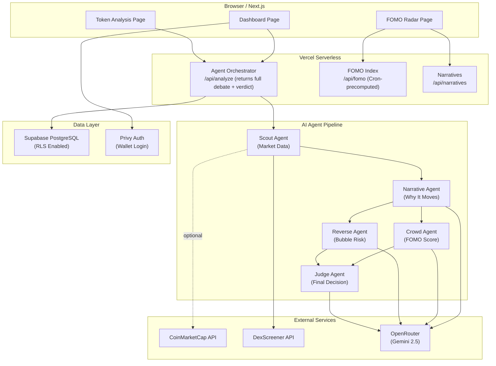
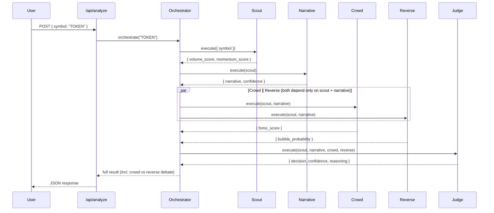
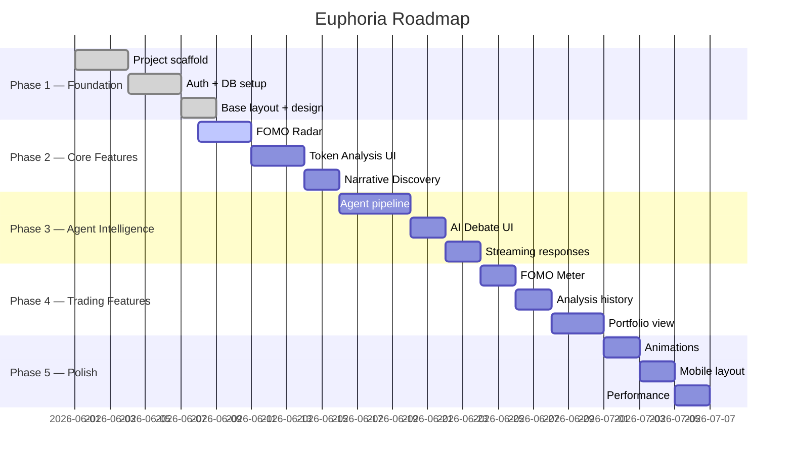

# Euphoria

**Trade Market Emotions, Not Charts.**

Retail traders on BNB Chain don't lose money for lack of charts — they lose by **buying euphoria and selling fear.** Euphoria is the instrument that measures that emotion. It's a multi-agent **market-psychology engine** that quantifies crowd FOMO, narrative, and bubble risk, then turns them into BUY / SELL / WATCH signals — and ships the same thesis as a **deterministic, backtestable Strategy Skill** that beats buy & hold with 2–4× smaller drawdowns.

Instead of RSI and candlesticks, Euphoria reads the one signal nobody else has instrumented: **how the crowd feels.**

> 🏆 **Built for [BNB Hack: AI Trading Agent Edition](https://dorahacks.io/hackathon/bnbhack-twt-cmc)** (CoinMarketCap × Trust Wallet × BNB Chain) — **Track 2: Strategy Skills.**
> Euphoria's psychology thesis ships as a deterministic, **backtestable Strategy Skill** (the [`euphoria-strategy`](packages/euphoria-strategy) npm package) that beats buy & hold with far lower drawdown. Sponsor capability: **CoinMarketCap** market data.
>
> 🎬 Demo video: [`demo/euphoria-demo.mp4`](demo/euphoria-demo.mp4)

[](LICENSE)
[](https://nextjs.org)
[](https://typescriptlang.org)

---

## Features

### FOMO Radar
Scans BNB Chain for narrative-driven momentum. Identifies which themes (AI, Memecoin, RWA, DePIN, Gaming, DeFi) are generating the most crowd excitement in real time.

### AI Agent Debate
Five specialized AI agents collaborate and debate before producing a trade signal. Watch Crowd Agent argue the bull case while Reverse Agent argues the bear case — then see the Judge decide.

### Backtestable Strategy Skill
The same psychology thesis, distilled into a **pure, deterministic strategy** you can backtest and ship. Packaged as [`euphoria-strategy`](packages/euphoria-strategy) (zero-dependency npm package) and exposed in-app at `/backtest`. Across BNB-ecosystem assets it preserves capital — going to cash when the crowd turns euphoric or fearful — beating buy & hold through drawdowns. See [Strategy Skill](#strategy-skill-npm-package).

### Narrative Discovery
Understands *why* markets move, not just that they moved. Each analysis surfaces the human story behind the price action.

### FOMO Meter
A 0–100 crowd excitement score with five psychological levels:

| Score | Level |
|---|---|
| 0–20 | Calm |
| 20–40 | Interest |
| 40–60 | Bullish |
| 60–80 | FOMO |
| 80–100 | Euphoria |

### Token Analysis Dashboard
Deep-dive analysis for any BNB Chain token: volume score, momentum score, narrative classification, bubble probability, and final BUY / SELL / WATCH verdict.

### Market Sentiment Analysis
Aggregated market-wide psychology view — which narratives are dominant, where crowd energy is concentrating, and what the overall market emotional state is.

---

## Architecture



---

## Agent System



> The "AI Debate" is the Crowd and Reverse verdicts shown side by side — produced in one `/api/analyze` call, not a second round-trip. There is no separate `/api/debate` LLM pipeline (it would double cost and latency for the same answer).

### Agent Responsibilities

| Agent | Role | Model | Output |
|---|---|---|---|
| **Scout** | Fetches market data, calculates volume & momentum scores | Heuristic | `{ volume_score, momentum_score }` |
| **Narrative** | Classifies the market narrative driving the token | Gemini 2.5 Pro | `{ narrative, confidence }` |
| **Crowd** | Measures crowd excitement and FOMO intensity | Gemini 2.5 Flash | `{ fomo_score }` |
| **Reverse** | Detects bubbles and overcrowded trades | Gemini 2.5 Flash | `{ bubble_probability }` |
| **Judge** | Synthesizes all agents into a final trade signal | Gemini 2.5 Pro | `{ decision, confidence, reasoning }` |

---

## Strategy Skill (npm package)

> **Track 2 deliverable.** Euphoria's market-psychology thesis as a deterministic, backtestable strategy — shippable on its own.

The package [`packages/euphoria-strategy`](packages/euphoria-strategy) is a **zero-dependency** TypeScript library that turns OHLCV candles into `BUY` / `SELL` / `WATCH` signals and backtests them vs buy & hold. It mirrors the live agents' logic (Scout → momentum, Crowd → FOMO, Reverse → bubble risk) but is pure and reproducible — no LLM, no randomness — so it can be unit-tested and replayed.

```ts
import { runBacktest, signalFor, computeFeatures, WARMUP, type Candle } from "euphoria-strategy";

const candles: Candle[] = await loadDailyCandles("BTCUSDT"); // Binance, CMC, etc.
const result = runBacktest("BTC", candles);
// → { totalReturnPct, buyHoldReturnPct, maxDrawdownPct, winRatePct, trades, sharpe, series }

const signal = signalFor(computeFeatures(candles.slice(-(WARMUP + 1)))); // "BUY" | "SELL" | "WATCH"
```

**Signal rules (long-only, with hysteresis):**
- **BUY** — `momentum ≥ 55`, `bubble ≤ 60`, `fomo ≥ 30` (healthy trend, not over-extended)
- **SELL** (risk-off) — `momentum ≤ 42` (broken trend / fear) **or** `fomo ≥ 75 && bubble ≥ 70` (euphoric top) → move to cash
- **WATCH** — hold

Build & test:

```bash
cd packages/euphoria-strategy && npm run build   # → dist/ (publishable)
npm run test                                      # strategy + engine unit tests (from repo root)
```

The in-app backtest UI (`/backtest`) and `GET /api/backtest?symbol=CAKE` run this same strategy over live historical candles.

---

## Tech Stack

### Frontend
| Technology | Version | Purpose |
|---|---|---|
| Next.js | 16 | Framework (App Router) |
| React | 19 | UI Library |
| TypeScript | 5 | Type Safety |
| Tailwind CSS | 4 | Styling |
| shadcn/ui | latest | Component Library |
| Framer Motion | latest | Animations |

### AI
| Technology | Purpose |
|---|---|
| OpenAI-compatible gateway | LLM access via `lib/llm.ts` — provider-agnostic |
| 9router (local) | Default gateway — routes to Claude / GPT / Gemini / DeepSeek |
| OpenRouter | Production gateway (set `LLM_PROVIDER=openrouter`) |
| Zod | Structured-output validation + normalization per agent |

> Agents call `/chat/completions` directly (`lib/llm.ts`) and validate output with Zod — the gateway is selected by `LLM_PROVIDER` and models are env-configurable (`*_MODEL_PRO` / `*_MODEL_FLASH`). The two reasoning tiers are **pro** (Narrative, Judge) and **flash** (Crowd, Reverse); Scout is a pure heuristic with no LLM call.

### Backend & Data
| Technology | Purpose |
|---|---|
| Next.js Route Handlers | API Layer |
| Supabase | PostgreSQL + Row Level Security |
| Privy | Wallet Authentication |

### Blockchain
| Technology | Purpose |
|---|---|
| BNB Chain | Target Network |
| Viem | Low-level Chain Interaction |
| Wagmi | React Hooks for Blockchain |

### Data Sources
| Technology | Purpose |
|---|---|
| CoinMarketCap API | Market Data & Trending Tokens |
| DexScreener API | DEX Volume & Price Data |

### Infrastructure
| Technology | Purpose |
|---|---|
| Vercel | Hosting, CI/CD, Serverless Functions |
| Vercel Analytics | User Analytics |

---

## Installation

### Prerequisites
- Node.js 20+
- npm 10+
- A Vercel account
- API keys (see Environment Variables)

### Clone & Install

```bash
git clone https://github.com/artomily/euphoria.git
cd euphoria
npm install
```

### Configure Environment

```bash
cp .env.example .env.local
```

Edit `.env.local` with your API keys (see Environment Variables section below).

### Install UI Dependencies

```bash
# Initialize shadcn/ui
npx shadcn@latest init

# AI — Vercel AI SDK + the official OpenRouter provider
npm install ai @openrouter/ai-sdk-provider

# UI
npm install framer-motion clsx tailwind-merge

# Data + Auth
npm install @supabase/supabase-js
npm install @privy-io/react-auth @privy-io/node   # react-auth = client, node = server verification

# Validation
npm install zod

# Blockchain — only needed once you add on-chain reads (wallet balance, etc.).
# Privy already provides wallet connect, so this can wait until after the MVP.
npm install viem wagmi @tanstack/react-query
```

> **Note:** Use `@openrouter/ai-sdk-provider` (`createOpenRouter`), not `@ai-sdk/openai`. Agents call `generateObject()` with Zod schemas for guaranteed structured output. The Privy **server** SDK is `@privy-io/node`, not `@privy-io/server`.

### Database Setup

```bash
# Apply Supabase migrations
npx supabase db push
```

### Run

```bash
npm run dev
```

Open [http://localhost:3000](http://localhost:3000).

---

## Environment Variables

| Variable | Required | Scope | Description |
|---|---|---|---|
| `NEXT_PUBLIC_PRIVY_APP_ID` | ✅ | Client | Privy app id, used by `<PrivyProvider>` |
| `NEXT_PUBLIC_SUPABASE_URL` | ✅ | Client | Supabase project URL (browser anon client) |
| `NEXT_PUBLIC_SUPABASE_ANON_KEY` | ✅ | Client | Supabase anon key — safe for client, RLS-gated |
| `NEXT_PUBLIC_APP_URL` | ⬜ | Client | Public app URL — OG tags, OpenRouter attribution |
| `LLM_PROVIDER` | ⬜ | Server | `9router` (default, local) or `openrouter` (production) |
| `NINEROUTER_BASE_URL` | ⬜ | Server | 9router endpoint (default `http://localhost:20128/v1`) |
| `NINEROUTER_API_KEY` | ⬜ | Server | 9router dashboard key (any value works locally) |
| `NINEROUTER_MODEL_PRO` / `NINEROUTER_MODEL_FLASH` | ⬜ | Server | Model aliases per connected provider (e.g. `claude-sonnet-4.5`, `deepseek-v4-flash`) |
| `OPENROUTER_API_KEY` | ⬜ | Server | Required only when `LLM_PROVIDER=openrouter` |
| `DEXSCREENER_API_URL` | ✅ | Server | DexScreener base URL — on-chain BNB Chain DEX data |
| `COINMARKETCAP_API_KEY` | ⬜ | Server | **Sponsor capability** — primary market read (price/volume/cap); free Basic key. App degrades to DexScreener-only without it |
| `SUPABASE_SERVICE_ROLE_KEY` | ✅ | Server | Supabase service role key — full DB access |
| `PRIVY_APP_SECRET` | ✅ | Server | Privy app secret for token verification |
| `PRIVY_VERIFIER_KEY` | ✅ | Server | Privy JWT verification key (`jwtVerificationKey`, skips a network call) |

> ⚠️ Never commit `.env.local`. Only `NEXT_PUBLIC_*` variables reach the browser — everything else is server-only. A `NEXT_PUBLIC_` prefix on a secret leaks it into the client bundle.

---

## Development

### Commands

```bash
npm run dev      # Start development server (localhost:3000)
npm run build    # Build for production (also type-checks)
npm run lint     # Run ESLint
npm start        # Start production server locally
```

### Project Structure

```
euphoria/
├── app/
│   ├── layout.tsx               # Root layout
│   ├── page.tsx                 # Landing page
│   ├── globals.css              # Global styles
│   ├── dashboard/               # Main dashboard
│   ├── radar/                   # FOMO Radar
│   ├── token/[symbol]/          # Token analysis (live agent pipeline)
│   ├── backtest/                # Strategy backtest UI
│   └── api/                     # Route handlers
│       ├── analyze/route.ts     # POST — run the agent pipeline
│       └── backtest/route.ts    # GET  — backtest the strategy skill
├── components/
│   ├── layout/                  # Header, sidebar
│   ├── dashboard/               # Dashboard widgets
│   ├── token/                   # Token page components
│   ├── agents/                  # Agent display cards
│   └── ui/                      # Base UI primitives
├── lib/
│   ├── agents/                  # Agent logic (pure functions)
│   │   ├── orchestrator.ts
│   │   ├── scout.ts
│   │   ├── narrative.ts
│   │   ├── crowd.ts
│   │   ├── reverse.ts
│   │   ├── judge.ts
│   │   └── prompts.ts
│   ├── backtest/                # Strategy Skill (in-app)
│   │   ├── strategy.ts          #   deterministic signal rules
│   │   ├── engine.ts            #   backtest loop + metrics
│   │   └── binance.ts           #   historical OHLCV source
│   ├── cmc.ts                   # CoinMarketCap client (sponsor capability)
│   ├── dexscreener.ts           # DexScreener client
│   ├── llm.ts                   # LLM gateway (9router / OpenRouter, OpenAI-compatible)
│   ├── format.ts
│   └── utils.ts
├── packages/
│   └── euphoria-strategy/       # Publishable Strategy Skill (npm package)
├── demo/                        # Demo video + assets
├── types/
└── docs/
```

---

## Deployment

### Vercel (Recommended)

1. Push to GitHub
2. Import project in [Vercel Dashboard](https://vercel.com/dashboard)
3. Add all environment variables in Vercel project settings
4. Deploy — Vercel handles the rest

### Manual Deploy

```bash
npm run build
vercel deploy --prod
```

### CI/CD

Every push to `main` triggers an automatic production deployment. All pull requests get a preview deployment URL.

---

## Roadmap



---

## Contributing

### Getting Started

1. Fork the repository
2. Create a feature branch: `git checkout -b feature/my-feature`
3. Make your changes
4. Run checks: `npm run lint && npm run build`
5. Commit: `git commit -m "feat(scope): description"`
6. Push: `git push origin feature/my-feature`
7. Open a Pull Request

### Commit Format

```
feat(agents): add Scout Agent with CMC integration
fix(fomo-meter): correct animation direction
chore(deps): upgrade framer-motion
docs(readme): update installation steps
```

### Code Standards

- TypeScript strict mode — no `any`
- Server Components by default
- Tailwind only — no inline styles
- Zod for all API validation
- Every agent has try/catch with fallback

### Pull Request Requirements

- Clear title following commit format
- Description of what and why
- Screenshots for UI changes
- All CI checks passing

---

## Disclaimer

Euphoria produces **market-psychology signals for research and educational purposes only.** Nothing it outputs is financial, investment, or trading advice. AI agents can be wrong, market data can be stale, and crypto assets are volatile and high-risk. Always do your own research. You are solely responsible for your own decisions.

---

## License

MIT © Euphoria Contributors
