# Euphoria — System Architecture

> **Trade Market Emotions, Not Charts.**

This document describes the complete technical architecture of Euphoria — an AI-powered market psychology platform for BNB Chain.

---

## Table of Contents

1. [System Overview](#system-overview)
2. [Agent Architecture](#agent-architecture)
3. [Frontend Architecture](#frontend-architecture)
4. [Backend Architecture](#backend-architecture)
5. [Data Flow](#data-flow)
6. [API Architecture](#api-architecture)
7. [Database Architecture](#database-architecture)
8. [AI Orchestration](#ai-orchestration)
9. [Security Model](#security-model)
10. [Scalability Considerations](#scalability-considerations)

---

## System Overview

Euphoria is a fully serverless application deployed on Vercel. There are no persistent servers, no background workers, and no containerized services. Every computation is request-driven.

### C4 Context Diagram

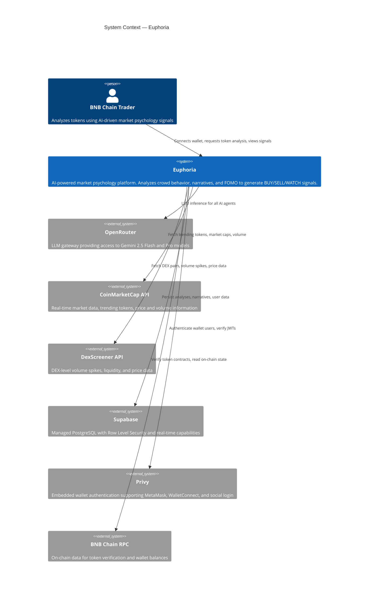

### Container Diagram

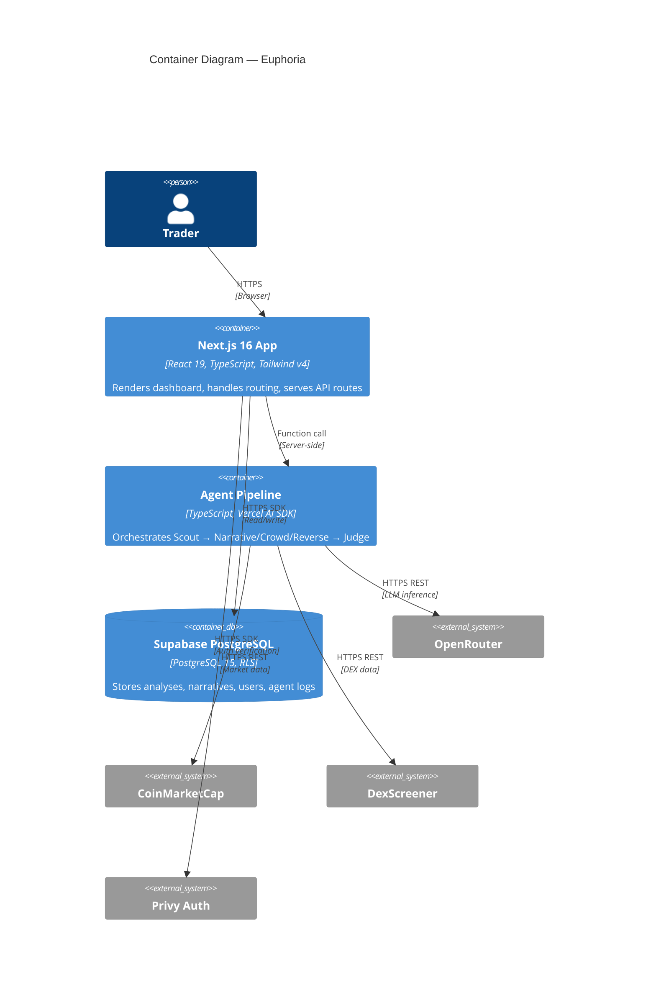

---

## Agent Architecture

The agent system is the core of Euphoria. Five specialized agents collaborate in a structured pipeline to produce trade signals.

### Agent Pipeline

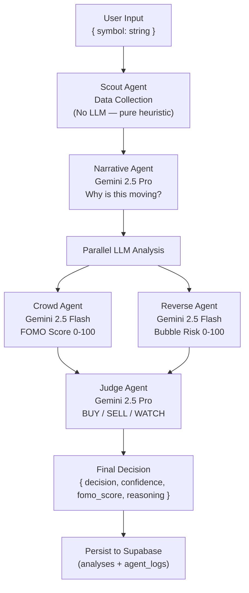

**Dependency graph (why it is not "all parallel"):** the agent input schemas define the order. `Narrative` needs `Scout`; `Crowd` and `Reverse` each need `Scout + Narrative` but **not each other**, so they run concurrently; `Judge` needs all four. The critical path is therefore `Scout → Narrative → (Crowd ∥ Reverse) → Judge` — one heuristic step plus **three** LLM hops, not five. An earlier draft claimed Narrative/Crowd/Reverse all ran in parallel; that contradicted the schemas and is corrected here.

### Agent Responsibilities

| Agent | File | Model | Input | Output |
|---|---|---|---|---|
| Scout | `lib/agents/scout.ts` | Heuristic | symbol | `{ volume_score, momentum_score }` |
| Narrative | `lib/agents/narrative.ts` | Gemini 2.5 Pro | ScoutOutput + market data | `{ narrative, confidence }` |
| Crowd | `lib/agents/crowd.ts` | Gemini 2.5 Flash | ScoutOutput | `{ fomo_score }` |
| Reverse | `lib/agents/reverse.ts` | Gemini 2.5 Flash | ScoutOutput | `{ bubble_probability }` |
| Judge | `lib/agents/judge.ts` | Gemini 2.5 Pro | All above outputs | `{ decision, confidence, reasoning }` |

### Orchestrator Pattern

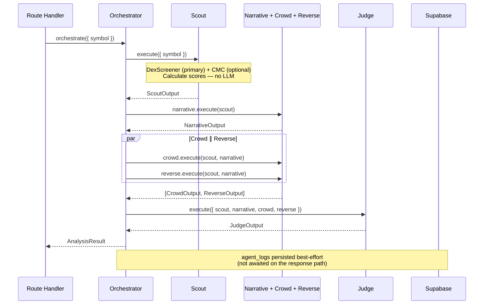

### Agent Execution Rules
- Scout always runs first — it provides raw data for all other agents (no LLM call)
- Narrative runs second (needs Scout)
- **Crowd and Reverse run in parallel** via `Promise.all()` — each needs only Scout + Narrative, never each other
- Judge always runs last with all prior outputs as context
- The route sets its own ceiling via `export const maxDuration` (e.g. 60s); there is no hard-coded "15s". Target p95 well under that — see the latency budget in [AI Orchestration](#ai-orchestration)
- Individual agent failures return neutral values and set `confidence: 0`; `agent_logs` writes are best-effort and never block the response

---

## Frontend Architecture

### Page Structure

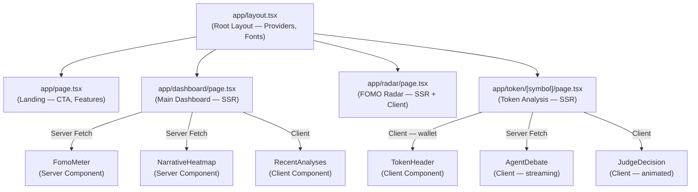

### Server vs Client Component Split

```mermaid
flowchart LR
    subgraph Server["Server Components (default)"]
        Layout["layout.tsx\nProviders setup"]
        DashPage["dashboard/page.tsx\nInitial data fetch"]
        TokenPage["token/[symbol]/page.tsx\nToken data fetch"]
        FomoMeter["FomoMeter\nStatic score display"]
        NarrativeHeatmap["NarrativeHeatmap\nStatic grid"]
    end

    subgraph Client["'use client' Components"]
        WalletBtn["WalletButton\nPrivy hook"]
        AnimMeter["AnimatedFomoMeter\nFramer Motion"]
        DebateView["AgentDebateView\nStreaming + state"]
        JudgeCard["JudgeDecisionCard\nAnimation + state"]
        TokenSearch["TokenSearch\nInput + router"]
    end

    Server -->|"passes props to"| Client
```

### Rendering Strategy
- **SSR (Server-Side Rendering):** Dashboard, Radar, Token pages — initial data fetched on server
- **Client Components:** Wallet interactions, Framer Motion animations, streaming debate views
- **Suspense Boundaries:** Each data section wrapped in Suspense with skeleton fallback
- **Streaming:** Agent debate responses streamed via SSE for real-time feel

---

## Backend Architecture

### Route Handler Structure

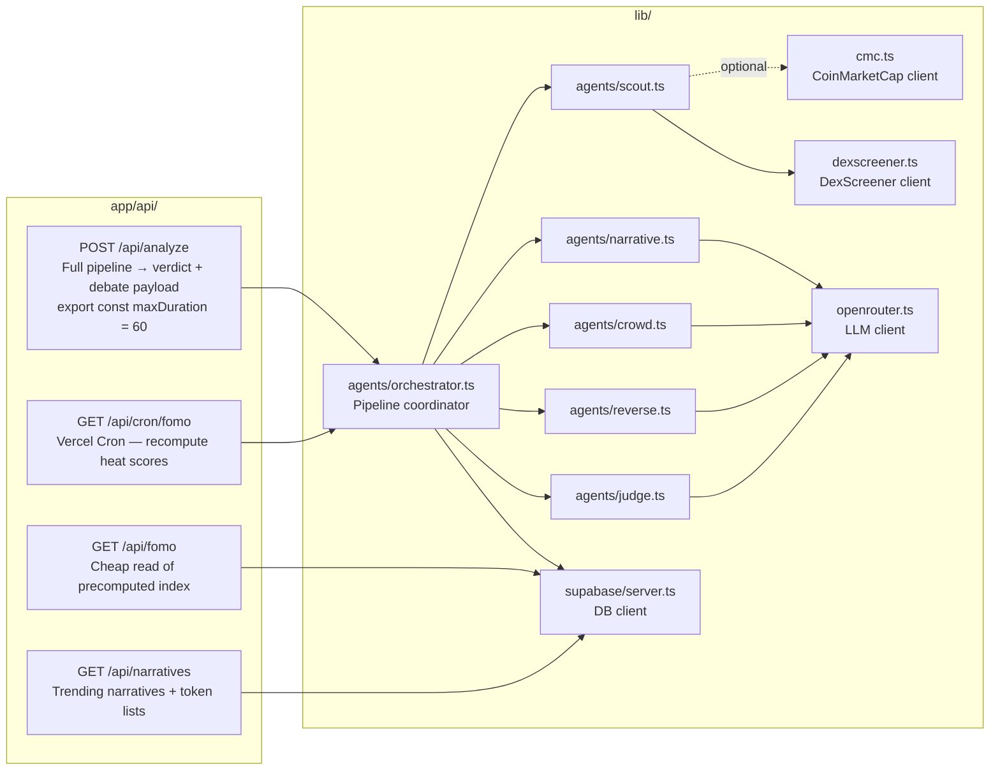

### Request Validation Pattern

All route handlers use Zod for input validation:

```typescript
// app/api/analyze/route.ts
const analyzeSchema = z.object({
  symbol: z.string().min(1).max(20).toUpperCase(),
});

export async function POST(request: Request) {
  const body = await request.json();
  const { symbol } = analyzeSchema.parse(body); // throws ZodError on invalid input
  // ...
}
```

### Caching Strategy

| Route | Cache Strategy | TTL |
|---|---|---|
| `GET /api/fomo` | `revalidate: 60` (reads Cron-precomputed rows) | 60 seconds |
| `GET /api/narratives` | `revalidate: 300` | 5 minutes |
| `POST /api/analyze` | `unstable_cache` keyed by `symbol` + time bucket | ~5 min (dedup) |
| `GET /api/cron/fomo` | No cache — write path | — |

> **`/api/analyze` is intentionally cache-served by symbol + a short time bucket.** Two users analyzing `CAKE` within the bucket get the same (cached) verdict instead of each triggering four fresh LLM calls. This is the single biggest LLM-cost lever and is implemented with the Next.js Data Cache (`unstable_cache`) — no Redis required.

---

## Data Flow

### Token Analysis Request

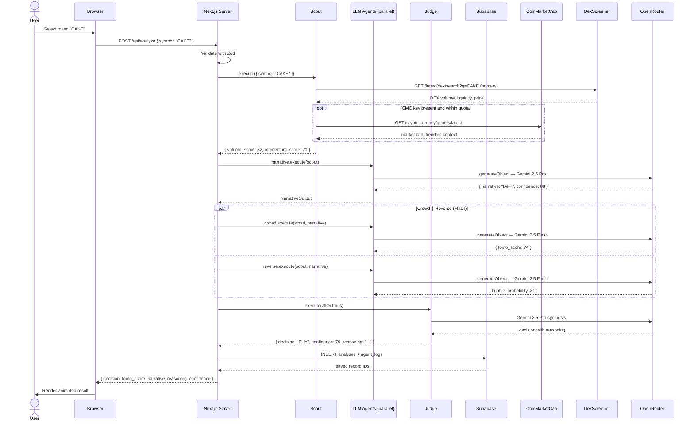

### FOMO Radar Data Flow

The FOMO index is **precomputed on a schedule, never on a user request.** Computing it inline would mean one unlucky visitor waits for ~10–20 token analyses (a cache-stampede / thundering-herd anti-pattern) and would blow the CoinMarketCap quota in minutes. Instead a **Vercel Cron** job recomputes it periodically and writes results to the `narratives` table; `GET /api/fomo` is a cheap read.

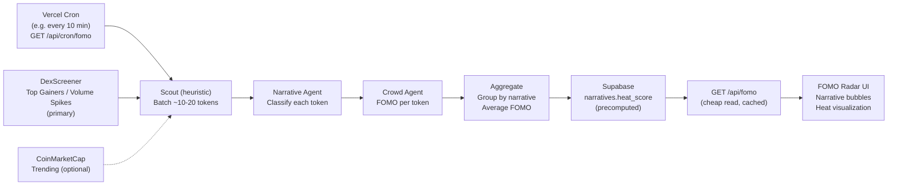

This is consistent with the "no persistent workers" rule: Vercel Cron is a scheduled invocation of a normal route handler, not a standing process. For the hackathon demo, the same handler can be hit manually once (`npm run warm`) so the radar is populated before judging.

---

## API Architecture

### Endpoint Catalog

#### `POST /api/analyze`

Full token analysis through the complete agent pipeline.

**Request:**
```typescript
{
  symbol: string; // e.g. "CAKE", "BNB", "PEPE"
}
```

**Response:**
```typescript
{
  symbol: string;
  fomo_score: number;           // 0-100
  decision: "BUY" | "SELL" | "WATCH";
  confidence: number;           // 0-100
  narrative: string;            // "DeFi", "AI", "Memecoin", etc.
  narrative_confidence: number; // 0-100
  bubble_probability: number;   // 0-100
  volume_score: number;         // 0-100
  momentum_score: number;       // 0-100
  reasoning: string;            // Judge's explanation
  analysis_id: string;          // UUID for saved record
}
```

**Response includes the debate payload** (`crowd` and `reverse` verdicts) so the UI can render the Crowd-vs-Reverse view without a second call.

**Config:** `export const maxDuration = 60`. Auth is optional — an anonymous request runs the full pipeline and is persisted with `user_id = null` (not attached to anyone's history). A wallet-authenticated request is scoped to that user.

**Errors:**
- `400` — Invalid symbol (Zod validation failure)
- `404` — Token not found on DexScreener/CMC
- `429` — Abuse limit exceeded (production only; deferred for hackathon)
- `500` — Pipeline failure (still returns a `WATCH` fallback where possible)

---

#### `GET /api/fomo`

Global FOMO index and per-narrative heat scores. **Cheap read** of values precomputed by the Cron job — it does not run the pipeline.

**Response:**
```typescript
{
  fomo_index: number; // Overall market FOMO 0-100
  narratives: Array<{
    name: string;       // "AI", "Memecoin", "RWA", etc.
    heat_score: number; // 0-100
    token_count: number;
    top_tokens: string[];
  }>;
  updated_at: string; // ISO timestamp
}
```

**Cache:** `revalidate: 60`

---

#### `GET /api/narratives`

Trending narratives with associated tokens.

**Response:**
```typescript
{
  narratives: Array<{
    id: string;
    name: string;
    heat_score: number;
    description: string;
    tokens: string[];
    trend: "rising" | "stable" | "cooling";
  }>;
}
```

**Cache:** `revalidate: 300`

---

#### `GET /api/cron/fomo` (Vercel Cron)

Recomputes per-narrative heat scores and the global FOMO index, writing to the `narratives` table. Invoked on a schedule via `vercel.json` `crons`. Protected by the `CRON_SECRET` header check that Vercel sends. Not called by the client.

---

#### ~~`POST /api/debate`~~ — removed (merged into `/api/analyze`)

> **Design decision:** a separate debate endpoint was specified in early drafts but **removed**. It would re-run the same Crowd/Reverse/Judge agents that `/api/analyze` already runs — doubling LLM cost and latency to produce the identical answer. The debate is now part of the `/api/analyze` response:
>
> ```typescript
> // included in the POST /api/analyze response
> debate: {
>   crowd:   { argument: string; fomo_score: number; supporting_points: string[] };
>   reverse: { argument: string; bubble_probability: number; warning_points: string[] };
> }
> ```
> The Judge verdict (`decision`, `confidence`, `reasoning`) is the top-level result. The UI composes the "debate" view from this single payload.

---

## Database Architecture

### Schema Design

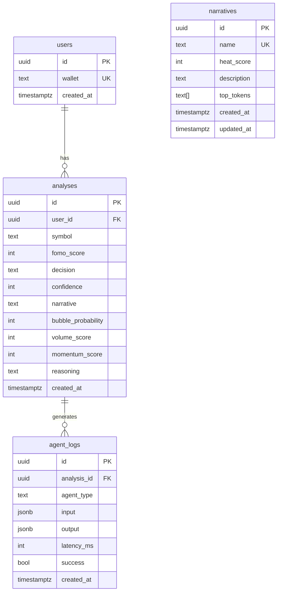

### Row Level Security Policies

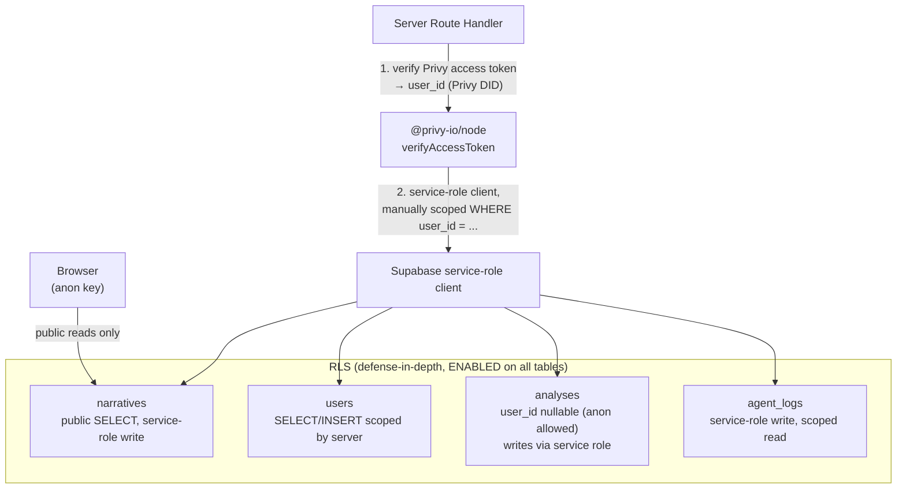

> **Why this shape (the critical correction):** Supabase RLS evaluates `auth.jwt()` against a **Supabase-issued** token. A **Privy** access token is invisible to it, so a policy like `wallet = auth.jwt()->>'wallet'` never matches a Privy-authenticated request. Two valid resolutions:
>
> 1. **MVP (shipped):** the server verifies the Privy token with `@privy-io/node`, derives `user_id`, then uses the **service-role** client with every query *manually* filtered by that `user_id`. RLS is kept enabled as a deny-by-default backstop (only the service role writes; the public anon key can read only `narratives`).
> 2. **Production (documented target):** register Privy as a Supabase **third-party auth** provider, or mint a short-lived Supabase JWT (signed with the Supabase JWT secret) carrying the Privy `sub`. Then the `auth.jwt()`-based policies in `engineering.md` apply natively and the client can talk to Supabase directly under RLS.
>
> The `engineering.md` policies describe target (2); the hackathon runs (1). `analyses.user_id` is **nullable** so anonymous analyses can be persisted by the server without a user.

### Migration Strategy
- Migrations in `supabase/migrations/` — one file per schema change
- Naming: `001_initial.sql`, `002_add_narrative_description.sql`
- Applied via `npx supabase db push`
- Never edit existing migrations — append new ones

---

## AI Orchestration

### Model Selection

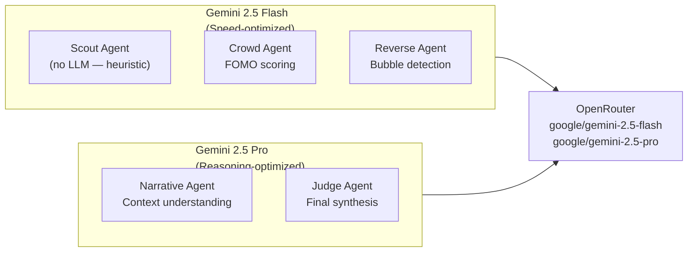

### LLM Client Pattern

All LLM calls go through `lib/openrouter.ts`, built on the official `@openrouter/ai-sdk-provider`. Agents call `generateObject` with a Zod schema — the model is forced into the schema, so there is **no JSON parsing and no "malformed output" branch.**

```typescript
// lib/openrouter.ts
import { createOpenRouter } from "@openrouter/ai-sdk-provider";
import { generateObject } from "ai";
import type { ZodSchema } from "zod";

const openrouter = createOpenRouter({
  apiKey: process.env.OPENROUTER_API_KEY!,
  appName: "Euphoria",
  appUrl: process.env.NEXT_PUBLIC_APP_URL,
  compatibility: "strict",
});

const MODELS = {
  flash: "google/gemini-2.5-flash",
  pro: "google/gemini-2.5-pro",
} as const;

export async function generateAgentObject<T>(opts: {
  tier: "flash" | "pro";
  schema: ZodSchema<T>;
  system: string;
  prompt: string;          // untrusted token data lives inside a delimited block
}): Promise<T> {
  const { object } = await generateObject({
    model: openrouter(MODELS[opts.tier], { plugins: [{ id: "response-healing" }] }),
    schema: opts.schema,
    system: opts.system,
    prompt: opts.prompt,
    temperature: 0.3,
  });
  return object;
}
```

### Latency Budget

The route sets `export const maxDuration = 60`, but the *target* p95 is far lower. With Scout adding no LLM hop, the chain is three sequential LLM steps (Crowd ∥ Reverse collapse into one):

| Step | Model | Budget |
|---|---|---|
| Scout (APIs + scoring) | none | ~1.5s |
| Narrative | Pro (→Flash fallback) | ~3–6s |
| Crowd ∥ Reverse | Flash (parallel) | ~2–4s |
| Judge | Pro | ~3–6s |
| **Total (target p95)** | | **~10–17s** |

Two mitigations keep this safe: **(1)** `MODEL_TIER` can drop Narrative to Flash, leaving Judge as the only Pro call; **(2)** the analyze result is cache-served by symbol, so repeat views are instant. Streaming the agents as they finish is a P1 UX enhancement, not a correctness requirement (see UI/UX § progressive reveal).

### Prompt Management

All prompts live in `lib/agents/prompts.ts` as typed template functions:

```typescript
// lib/agents/prompts.ts
export const narrativePrompt = (data: NarrativeInput): string =>
  `Analyze this token and classify its market narrative...`;

export const crowdPrompt = (data: CrowdInput): string =>
  `Calculate the FOMO score for this token...`;
```

### Failure Handling

Because `generateObject` guarantees a schema-valid object, the only failure mode is network/timeout — not bad JSON.

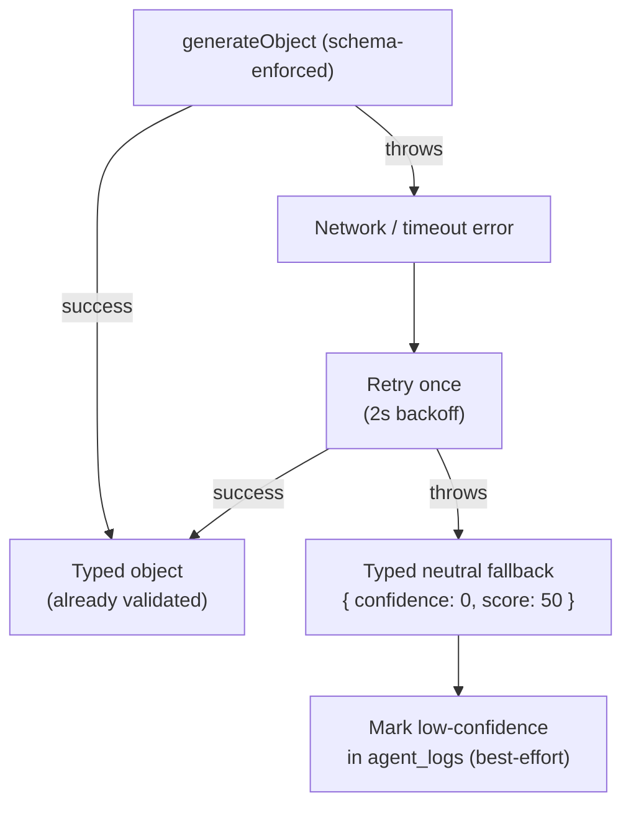

---

## Security Model

### Authentication Flow

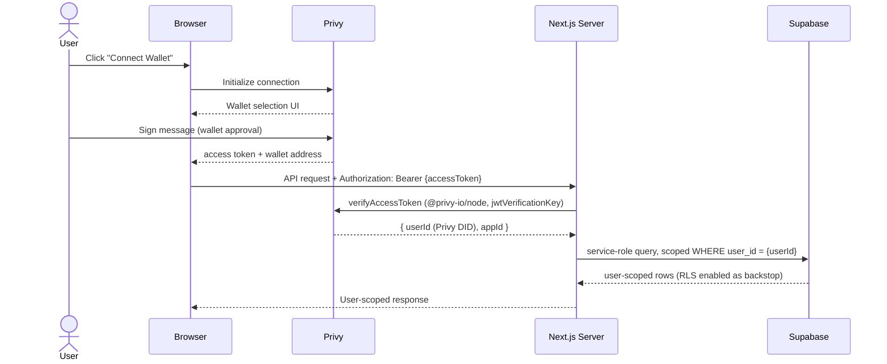

### Security Layers

| Layer | Control | Implementation |
|---|---|---|
| Authentication | Privy `verifyAccessToken` | `@privy-io/node` in `lib/privy/verify.ts`; `jwtVerificationKey` avoids a network call |
| Authorization | Server-side scoping + RLS backstop | Service-role client filtered by verified `user_id`; RLS enabled deny-by-default (see DB § Privy↔Supabase) |
| Input Validation | Zod schemas | Route handler boundary |
| Prompt-injection defense | Delimited untrusted data + schema output | Token name/symbol never enter instructions; `generateObject` constrains output |
| LLM cost control | Analyze cache + Cron-precomputed FOMO | `unstable_cache` by symbol; no per-request index recompute |
| Abuse limiting | Supabase counter / Vercel firewall | **Production only — deferred for hackathon** (no Redis, so no in-memory limiter) |
| Secret Management | Vercel Env Vars | Server-only secrets never `NEXT_PUBLIC_`, never in client bundles |
| Error Sanitization | Custom error handler | Stack traces never reach client |
| Compliance | "Not financial advice" disclaimer | Footer + adjacent to every verdict |

### Client vs Server Variable Exposure

```
NEXT_PUBLIC_*  → Browser-safe: PRIVY_APP_ID, SUPABASE_URL, SUPABASE_ANON_KEY, APP_URL
Everything else → Server-only: OPENROUTER_API_KEY, SUPABASE_SERVICE_ROLE_KEY,
                  PRIVY_APP_SECRET, PRIVY_VERIFIER_KEY, COINMARKETCAP_API_KEY, DEXSCREENER_API_URL
```

---

## Scalability Considerations

### Current Bottlenecks

| Concern | Current State | Mitigation |
|---|---|---|
| Per-request latency | 3 sequential LLM hops | `maxDuration=60`; Narrative→Flash fallback; analyze cache by symbol |
| LLM cost at scale | 4 model calls per uncached analysis | Cache by symbol + time bucket; Cron precomputes FOMO (not per-request) |
| OpenRouter rate limits | Per-key limits | Retry with backoff; OpenRouter auto-fallback; org key at scale |
| CoinMarketCap quota | 333 calls/day (free tier) | **DexScreener is primary**; CMC optional + only hit by the Cron batch, not user requests |
| Supabase connections | ~15 (free tier) | Use the Supabase pooler URL for serverless |
| Cold starts | ~300ms first request | Warm critical routes before demo; Vercel Pro/Fluid reduces penalty |
| FOMO index stampede | Could block a user | Cron-precompute → `/api/fomo` is a cheap read |

### Caching Architecture

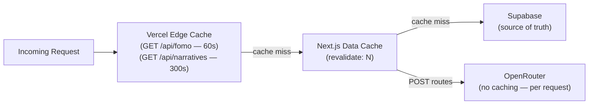

### Scaling Path

**Phase 1 (Current — Hackathon):**
- Single Vercel project, free tier
- No caching beyond Next.js defaults
- CoinMarketCap free tier (333 req/day)

**Phase 2 (Production):**
- Vercel Pro for increased function limits and reduced cold starts
- CoinMarketCap paid tier for higher rate limits
- Supabase Pro for connection pooling and larger database
- Add Vercel KV for token data caching

**Phase 3 (Scale):**
- Dedicated OpenRouter organization for higher throughput
- Supabase read replicas for analytics queries
- Edge-cached narrative data with background revalidation
- Consider Vercel Edge Functions for FOMO index (sub-100ms response)
