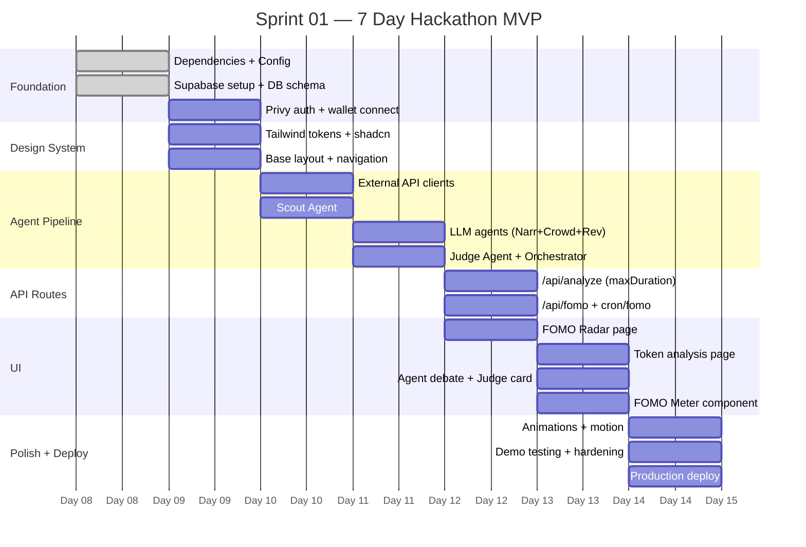

# Euphoria — Sprint 01: Hackathon MVP

**Duration:** 7 Days
**Goal:** Functional, visually impressive hackathon demo
**Definition of Done:** Demo runs live, wallet connects, token analysis produces BUY/SELL/WATCH with agent debate visible

---

## Sprint Overview

---

## Sprint Goal

Deliver a working hackathon demo that demonstrates:
1. **Wallet connection** — via Privy, BNB Chain
2. **FOMO Radar** — narrative heat scores, live market psychology
3. **Token Analysis** — full 5-agent pipeline visible and animated
4. **AI Debate** — Crowd vs Reverse agent debate before Judge decides
5. **FOMO Meter** — animated 0–100 gauge with psychological level
6. **Judge Decision** — clear BUY/SELL/WATCH with confidence and reasoning

**The demo must feel alive.** Numbers animate. Agents appear sequentially. The decision lands with impact.

---

## Day 1: Foundation

**Date:** Day 1
**Theme:** Infrastructure complete, dev environment running

### Tasks

| # | Task | Priority | Complexity | Est. |
|---|---|---|---|---|
| 1 | Install all production dependencies | P0 | S | 30m |
| 2 | Initialize shadcn/ui with dark theme | P0 | S | 20m |
| 3 | Configure Tailwind v4 design tokens (all CSS variables) | P0 | M | 1h |
| 4 | Create `.env.example` with all variables | P0 | S | 15m |
| 5 | Set up Supabase project + credentials | P0 | S | 30m |
| 6 | Write and apply database migration (`001_initial.sql`) | P0 | M | 1h |
| 7 | Apply RLS policies to all tables | P0 | M | 45m |
| 8 | Seed narratives table (8 categories) | P1 | S | 15m |
| 9 | Create Supabase browser + server clients | P0 | S | 30m |
| 10 | Create TypeScript types (agents.ts, api.ts, database.ts) | P0 | M | 1h |
| 11 | Create `lib/utils.ts` with `cn()` helper | P0 | S | 10m |
| 12 | Update `app/layout.tsx` (remove create-next-app branding) | P0 | S | 15m |

### Deliverable
- `npm run dev` works without errors
- Supabase tables created, RLS applied
- All design tokens defined
- TypeScript strict mode passes

### Risk
- Supabase free tier already in use — need a fresh project
- Privy setup may require App ID which needs dashboard access

---

## Day 2: Auth + Base Layout

**Date:** Day 2
**Theme:** Wallet connects, app has a shell

### Tasks

| # | Task | Priority | Complexity | Est. |
|---|---|---|---|---|
| 1 | Configure Privy provider in root layout | P0 | M | 1.5h |
| 2 | Create wallet connect button component | P0 | M | 1h |
| 3 | Privy access-token verification (`@privy-io/node`, `verifyAccessToken`) + service-role scoping helper | P0 | M | 1h |
| 4 | Create/upsert user in Supabase on wallet connect | P0 | M | 1h |
| 5 | Create sidebar navigation component | P0 | M | 1.5h |
| 6 | Create header component | P0 | M | 1h |
| 7 | Create dashboard layout wrapper | P0 | S | 30m |
| 8 | Create `lib/format.ts` number formatters | P1 | S | 45m |
| 9 | Create `lib/openrouter.ts` LLM client | P0 | M | 1.5h |
| 10 | Basic landing page (tagline + CTA) | P1 | L | 2h |

### Deliverable
- Navigate to `localhost:3000`
- Click "Connect Wallet" → Privy modal appears
- Connect MetaMask → wallet address in header
- Navigate between Dashboard and FOMO Radar
- User record created in Supabase

### Risk
- Privy setup complexity may exceed estimate — have MetaMask as primary, skip WalletConnect for MVP
- If Privy blocks progress, use temporary address-in-URL pattern for demo

---

## Day 3: External APIs + Scout Agent

**Date:** Day 3
**Theme:** Real market data flowing through the system

### Tasks

| # | Task | Priority | Complexity | Est. |
|---|---|---|---|---|
| 1 | Create CoinMarketCap API client | P0 | M | 1.5h |
| 2 | Create DexScreener API client | P0 | M | 1.5h |
| 3 | Implement Scout Agent (volume + momentum scoring) | P0 | M | 2h |
| 4 | Create `POST /api/analyze` — Scout-only first version | P0 | M | 1h |
| 5 | Test Scout Agent with 5 BNB Chain tokens | P0 | S | 30m |
| 6 | Create all agent prompt templates in `lib/agents/prompts.ts` | P0 | M | 1.5h |
| 7 | Create `GET /api/fomo` — basic version (DB read) | P0 | M | 1h |
| 8 | Create `GET /api/narratives` | P0 | S | 30m |

### Deliverable
- `POST /api/analyze { symbol: "CAKE" }` returns Scout scores
- `GET /api/fomo` returns narrative heat scores from DB
- Test in Thunder Client / curl — all responses are valid JSON

### Risk
- CoinMarketCap free tier: 333 requests/day — careful during development (cache responses)
- DexScreener API may return no results for some BNB tokens — test symbol set early

---

## Day 4: Agent Intelligence

**Date:** Day 4
**Theme:** All 5 agents running, pipeline producing decisions

### Tasks

| # | Task | Priority | Complexity | Est. |
|---|---|---|---|---|
| 1 | Narrative Agent — `generateObject` + Zod, tier `pro` (Flash fallback via `MODEL_TIER`) | P0 | M | 2h |
| 2 | Crowd Agent — `generateObject` + Zod, tier `flash` | P0 | M | 1.5h |
| 3 | Reverse Agent — `generateObject` + Zod, tier `flash`, **independent of Crowd** | P0 | M | 1.5h |
| 4 | Judge Agent — `generateObject` + Zod, tier `pro` (the one required Pro call) | P0 | M | 2h |
| 5 | Orchestrator — `Scout → Narrative → Promise.all([Crowd, Reverse]) → Judge` | P0 | M | 2h |
| 6 | `POST /api/analyze` with orchestrator, `maxDuration=60`, returns verdict + debate | P0 | M | 1h |
| 7 | `GET /api/cron/fomo` + manual `npm run warm` (no separate `/api/debate`) | P1 | M | 1h |
| 8 | Test full pipeline end-to-end with 5 tokens | P0 | S | 45m |
| 9 | Tune prompts based on test results | P0 | M | 1.5h |

### Deliverable
- `POST /api/analyze { symbol: "CAKE" }` returns full analysis: Scout scores, narrative, FOMO score, bubble risk, judge decision, reasoning, **and the `debate` (crowd + reverse) payload** in one response
- Agent logs saved best-effort (not awaited)
- Cron handler populates `narratives.heat_score`
- Pipeline completes within `maxDuration` (target p95 ~10–17s)

### Risk
- Output format — **non-issue:** `generateObject` + Zod guarantees a valid typed object; the only failure path is network/timeout, handled by retry + neutral fallback
- OpenRouter rate limits — add 2s delay between test calls during development
- Pro latency — if the budget is tight, set `MODEL_TIER=lean` to drop Narrative to Flash; **keep Judge on Pro** (it's the demo's wow moment)

---

## Day 5: Core UI

**Date:** Day 5
**Theme:** FOMO Radar and token analysis page visible and functional

### Tasks

| # | Task | Priority | Complexity | Est. |
|---|---|---|---|---|
| 1 | Build narrative card component | P0 | M | 1.5h |
| 2 | Build FOMO Radar page (full UI) | P0 | L | 2.5h |
| 3 | Build token search input | P0 | M | 1h |
| 4 | Create token analysis page route | P0 | S | 30m |
| 5 | Build token header component (price, change) | P0 | M | 1h |
| 6 | Build token metrics grid (volume score, momentum) | P0 | M | 1.5h |
| 7 | Build agent card base component | P0 | M | 1.5h |
| 8 | Wire token analysis page to `POST /api/analyze` | P0 | L | 2h |
| 9 | Loading skeleton components | P1 | M | 1h |

### Deliverable
- Navigate to `/radar` → see 8 narrative cards with heat scores
- Enter "CAKE" in token search → navigate to `/token/CAKE`
- Token analysis page shows Scout data, skeleton for agents loading

### Risk
- FOMO Radar looks empty if narrative heat_scores are all 0 — run manual update before demo
- Token analysis page timing — ensure skeleton → results transition is smooth

---

## Day 6: Agent Debate + FOMO Meter

**Date:** Day 6
**Theme:** The full agent experience visible and animated

### Tasks

| # | Task | Priority | Complexity | Est. |
|---|---|---|---|---|
| 1 | Build Scout Agent card | P0 | S | 45m |
| 2 | Build Narrative Agent card | P0 | S | 45m |
| 3 | Build Crowd Agent card | P0 | M | 1h |
| 4 | Build Reverse Agent card | P0 | M | 1h |
| 5 | Build Judge Decision card (hero component) | P0 | L | 2.5h |
| 6 | Build AI Debate view (Crowd vs Reverse + Judge reveal) | P0 | L | 2.5h |
| 7 | Build FOMO Meter gauge component | P0 | L | 2.5h |
| 8 | Build main Dashboard page | P0 | L | 2h |
| 9 | Agent execution timeline indicator | P1 | M | 1h |

### Deliverable
- Full token analysis page works end-to-end:
  - Loading → Scout card → Parallel agents → Debate → Judge decision
  - FOMO Meter animates to final score
  - BUY/SELL/WATCH badge appears with impact
- Dashboard shows FOMO Meter + narrative cards

### Risk
- FOMO Meter SVG arc animation complexity — have a fallback linear bar design ready
- Judge Decision reveal timing may need tuning — test with multiple tokens

---

## Day 7: Polish, Demo Prep & Deploy

**Date:** Day 7
**Theme:** Demo-ready, deployed, tested with real data

### Tasks

| # | Task | Priority | Complexity | Est. |
|---|---|---|---|---|
| 1 | Add Framer Motion animations to agent cards (stagger) | P0 | M | 1.5h |
| 2 | Add FOMO score counter animation | P0 | S | 45m |
| 3 | Add Judge decision reveal animation | P0 | M | 1h |
| 4 | Add page transitions | P1 | M | 1h |
| 5 | Mobile layout testing and fixes | P1 | M | 1.5h |
| 6 | Error states (analysis failed, token not found) | P0 | S | 1h |
| 7 | Run full demo flow 10 times — fix all edge cases | P0 | M | 1.5h |
| 8 | Prepare demo token list (5 tokens with good FOMO) | P0 | S | 30m |
| 8a | **Warm the FOMO Radar** — run `npm run warm` so `narratives.heat_score` is populated before judging | P0 | S | 15m |
| 8b | Add "not financial advice" disclaimer (footer + beside every verdict) | P0 | S | 20m |
| 9 | Security check (no `NEXT_PUBLIC_` secrets in client, service-role scoping, RLS enabled) | P0 | S | 30m |
| 10 | Configure Vercel project + environment variables | P0 | S | 30m |
| 11 | Deploy to Vercel production | P0 | S | 30m |
| 12 | Verify production deployment with live test | P0 | S | 30m |
| 13 | Take screenshots for README | P1 | S | 20m |
| 14 | Update README with live demo URL | P1 | S | 15m |

### Deliverable
- Live production URL deployed
- Demo flow tested 10+ times without errors
- All animations working
- README updated with screenshots and demo URL

### Risk
- Vercel build failure — run `npm run build` locally before deploying
- Production API keys may hit rate limits — have demo mode ready

---

## Demo Objectives

The hackathon demo must demonstrate these moments in order:

### Moment 1: The Connection (0–30 seconds)
- Navigate to live URL
- "Trade Market Emotions, Not Charts" hero
- Click "Connect Wallet"
- MetaMask signs in 2 clicks
- Dashboard appears with FOMO Radar visible

**Judge impression:** "Slick onboarding, immediately shows value"

### Moment 2: The Radar (30–60 seconds)
- FOMO Radar shows all 8 narratives with heat scores
- AI narrative glowing red/orange (highest FOMO)
- Point out: "This is the global market psychology right now"
- Click on AI narrative → shows top tokens

**Judge impression:** "I've never seen market data presented this way"

### Moment 3: The Analysis (60–120 seconds)
- Type "CAKE" in token search
- Navigate to analysis page
- Agents appear one by one:
  - Scout: "Volume score 82/100 — significant spike detected"
  - Narrative: "DeFi — 88% confidence"
  - Crowd: "74/100 — FOMO zone 🔥"
  - Reverse: "31% bubble risk — reasonable entry"
- Debate view: Crowd argues bull case, Reverse argues bear
- Judge arrives: **BUY — 79% confidence**
- FOMO Meter animates to 74

**Judge impression:** "These agents are actually reasoning — this is AI debate!"

### Moment 4: The Meter (120–150 seconds)
- Point to FOMO Meter
- Explain the 5 psychological levels
- "This is what market psychology looks like. At 74 — FOMO, but not yet Euphoria"
- "When this hits 85+, Euphoria, the Reverse Agent starts screaming sell"

**Judge impression:** "The FOMO scale is brilliant — finally a number that means something"

### Moment 5: The Close (150–180 seconds)
- Switch to a second token (DOGE or BNB)
- Run analysis — different decision appears
- "Every token tells a different psychological story"
- Show the reasoning from Judge Agent — it's specific, not generic
- "This is the future of trading — not charts, emotions"

**Judge impression:** "Real AI reasoning, real data, real product"

---

## Risk Register

| Risk | Probability | Impact | Contingency |
|---|---|---|---|
| OpenRouter rate limit during live demo | Medium | High | Pre-compute + cache 5 demo tokens; analyze-by-symbol cache; demo-mode flag |
| Pipeline latency near route ceiling | Medium | High | `maxDuration=60`; `MODEL_TIER=lean` (Narrative→Flash); keep Judge on Pro |
| Privy↔Supabase RLS gap (policies never match) | High if unaddressed | High | Verify Privy server-side + service-role scoping (built Day 2) — don't rely on `auth.jwt()` |
| CoinMarketCap quota exhausted | Low | Low | DexScreener is primary; CMC optional and Cron-only |
| Prompt injection via token name/symbol | Low | Medium | Delimited `<data>` blocks; schema-constrained output |
| Empty FOMO Radar at demo time | Medium | High | `npm run warm` before judging (Day 7 task 8a) + seeded baseline |
| Privy wallet auth fails during demo | Low | High | Pre-sign in before demo; MetaMask primary |
| Vercel cold start delays | Medium | Medium | Warm critical routes before demo |
| ~~Agent JSON parsing failure~~ | — | — | Eliminated — `generateObject` + Zod returns a valid object or throws |
| FOMO Meter SVG animation glitch | Low | Medium | Linear-bar fallback; test on demo device |
| Token not found | Low | Medium | Pre-validate demo tokens on DexScreener; backup symbols ready |
| Vercel build failure | Low | High | Run `npm run build` locally 1h before demo |

---

## Definition of Done

A task is done when:
- [ ] Code written and linting passes (`npm run lint`)
- [ ] TypeScript strict mode passes (`npm run build`)
- [ ] Feature works in browser (manually tested)
- [ ] No console errors in browser developer tools
- [ ] No `console.log` left in committed code

The Sprint is done when:
- [ ] Live production URL accessible without authentication
- [ ] Anonymous user can analyze a token (try-before-connect); wallet connect works on demo device
- [ ] Token analysis completes within `maxDuration` (target p95 ~10–17s); repeat views are instant (cached)
- [ ] Agent debate shows Crowd vs Reverse positions
- [ ] Judge Decision renders with BUY/SELL/WATCH badge
- [ ] "Not financial advice" disclaimer visible (footer + beside verdict)
- [ ] FOMO Meter animates to final score
- [ ] FOMO Radar shows all 8 narratives, warmed (not empty)
- [ ] 5 demo tokens pre-tested with good results documented
- [ ] README has live URL and screenshots
- [ ] No `NEXT_PUBLIC_` secrets; no env files committed

---

## Post-Sprint Backlog

Items explicitly deferred from Sprint 01:

| Item | Reason Deferred |
|---|---|
| Analysis history page | Not needed for demo |
| Token watchlist | Not needed for demo |
| Real-time FOMO updates | Adds complexity without visual impact |
| Mobile polish | Judges likely use desktop |
| Portfolio view | Phase 4 scope |
| Sharing features | Post-hackathon |
| Rate limiting | Adds complexity; not needed for demo scale |
| Social signal integration | Requires additional API keys |

---

## Daily Standup Format

Each day, answer:
1. **Yesterday:** What did I complete? What's now working?
2. **Today:** What will I build? What's the risk?
3. **Blockers:** What's slowing me down?

Target: 5-minute standup. Unblock immediately — don't wait until next day.

---

## Velocity Notes

**Estimated hours per day:** 8–10 hours of focused work

**Day buffer allocation:**
- Days 1–4: Foundation + backend — more predictable
- Days 5–6: Frontend UI — most uncertain (design polish takes time)
- Day 7: Reserve for debugging, polish, and deployment

**If behind schedule priority order:**
1. Keep: wallet connect, full agent pipeline, BUY/SELL/WATCH display
2. Simplify: FOMO Meter (bar instead of gauge), minimal animations
3. Drop: Demo mode, sharing, history page, mobile layout
4. Never drop: Agent debate view, FOMO score, judge reasoning
